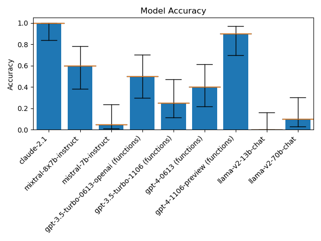
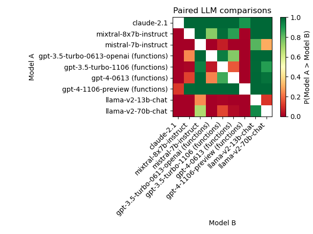

# `bayes_evals`: A lightweight library for Bayesian analysis of LLM evals

## Installation
This is a simple package, so you can just download the `bayes_evals.py` file and put it in your project directory, e.g. with `wget`:
```bash
wget https://raw.githubusercontent.com/sambowyer/bayes_evals/main/src/bayes_evals/bayes_evals.py
```
or `curl`:
```bash
curl -L -O https://raw.githubusercontent.com/sambowyer/bayes_evals/main/src/bayes_evals/bayes_evals.py
```

Alternatively, you can install the package by cloning this repository and using pip:
```bash
pip install -e .
```

## Usage
```python
import bayes_evals as be
import pandas as pd

# Load the data (should NOT contain an index column)
eval_data = pd.from_csv('data/evals.csv')

# Get the results either for individual LLMs (each column in the data)
# with a specified confidence level alpha (default=0.05)...
indep_intervals = be.independent_intervals(eval_data, alpha=0.05)

# ... in which case you can also do independent LLM comparisons...
indep_comparisons = be.independent_comparisons(eval_data)

# ... or get pairwise comparisons between LLMs
paired_comparisons = be.paired_comparisons(eval_data)
```
Each of the `indep_results`, `indep_comparisons`, and `paired_comparisons` objects are just `pd.DataFrame` objects with model names as the column names.
The `indep_results` object has two rows: `lower` and `upper`.
The `indep_comparisons` and `paired_comparisons` objects have a row for each model, with entry at row $i$ and column $j$ being the probability that model $i$ is better than model $j$.

## Data format
The data should be in a `pandas` DataFrame, with $Q$ = no. questions rows and $M$ = no. LLMs columns.
The data should be binary, with 1 indicating a correct answer and 0 indicating an incorrect answer.
The columns should be named with the LLMs' names.

## Displaying results
You can also make matplotlib plots of the results using the following functions:
```python
be.plot_intervals(eval_data, indep_intervals, filename='plots/indep_intervals.png')
```


```python
be.plot_comparisons(indep_comparisons, filename='plots/indep_comparisons.png', title="Independent LLM comparisons")
```


```python
be.plot_comparisons(paired_comparisons, filename='plots/paired_comparisons.png', title="Paired LLM comparisons")
```


## Examples
See the `examples` directory for a Jupyter notebook and basic script that generate the above plots:
- [Jupyter notebook](examples/basic_example.ipynb)
- [Script](examples/basic_example.py)